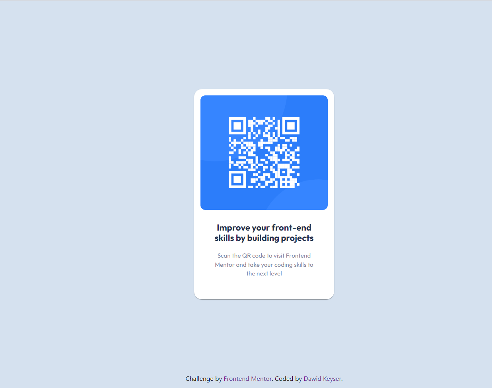

# Frontend Mentor - QR code component solution

This is a solution to the [QR code component challenge on Frontend Mentor](https://www.frontendmentor.io/challenges/qr-code-component-iux_sIO_H). Frontend Mentor challenges help you improve your coding skills by building realistic projects.

## Table of contents

- [Overview](#overview)
  - [Screenshot](#screenshot)
  - [Links](#links)
- [My process](#my-process)
  - [Built with](#built-with)
  - [What I learned](#what-i-learned)
  - [Continued development](#continued-development)
  - [Useful resources](#useful-resources)
- [Author](#author)

## Overview

The challenge was to build out this QR code component and get it looking as close to the design as possible.
As I am wanting to learn React using Material UI (mui) I decided to focus on learning those frameworks as I take on the challenges from Frontend Mentor.

The task was to build out the project to the designs inside the `/design` folder. The designs were in JPG static format. Using JPGs meant that I had to use my best judgment for styles such as `font-size`, `padding` and `margin`. I did use the figma design files to get more information for this project.

### Screenshot



### Links

- Solution URL: [Dawid Keyser - QR Code Solution](https://github.com/dawkey95/QR-Code-Challenge)
- Live Site URL: [Dawid Keyser - QR Code Live Site](https://dakey-qr-code-challenge.netlify.app/)

## My process

### Built with

- HTML5
- CSS
- [Normalize.css](https://necolas.github.io/normalize.css/) - Normalise.css
- [React](https://reactjs.org/) - JS library
- [Material UI](https://mui.com/) - React Component Library

### What I learned

One of the biggest things I wanted to learn through doing this challenge was Material UI, how the components work, how to customise them and how to create my own themes using `createTheme` and `ThemeProvider`.

In stead of creating the theme in my `App.js` file I decided to create a `theme.js` file in my `components` folder. In my theme file I then used `createTheme` to create a custom theme for my project using the colors and fonts provided for this challenge.

```js
const theme = createTheme({
	palette: {
		qrCode: {
			white: '#FFFFFF',
			lightGray: '#D5E1EF',
			grey: '#7D889E',
			darkBlue: '#1F314F',
		},
	},
	breakpoints: {
		values: {
			mobile: 375,
			desktop: 1440,
		},
	},
	typography: {
		fontFamily: ['Outfit', 'sans-serif'].join(','),
	},
});

export default theme;
```

I was then imported my `theme.js` into my `App.js`

```js
import theme from './components/theme';
```

Then I had to wrap my App in my created theme using the `ThemeProvider` in order to ensure that the changes would be available in the entire App.

```js
<ThemeProvider theme={theme}>
	<Card />
</ThemeProvider>
```

### Continued development

Learning to use the custom themes in material ui is something I want to focus on as I believe being able to get a good grasp on the concept would allow for better and easier customisation as apps grow larger and more complex.

One of the main benefits of this approach is that if you had a color pallette with all `title` set to be `red` and then there was a change made and they wanted all `title` to now be `blue` you would only need to change the one line in your `theme.js` without needing to change every instance of the `title` color manually.

```js
  typography: {
		title: {
      color: 'blue'
    }
	},
```

Learning how to create my own custom theme is one my main focuses alongside learning React.

Another change I will implement in my next project is to replace the `normalise.css` with Material UI's own `CSSBaseLine` which acts as a global reset for your `css`.

### Useful resources

- [Material UI Crash Course: Intro to React + Material UI V5 (2022 Edition)](https://www.youtube.com/watch?v=_W3uuxDnySQ) - This video gave me a good understanding of Material UI and especially custom theme.

  <br>

- [react-mui-theme blog](https://www.welcomedeveloper.com/react-mui-theme) - This article helped me around the idea of a custom theme and how I could create a `theme.js` and then import that file into my `App.js`

## Author

- GitHub - [@dawkey95](https://github.com/dawkey95)
- Frontend Mentor - [@dawkey95](https://www.frontendmentor.io/profile/dawkey95)
